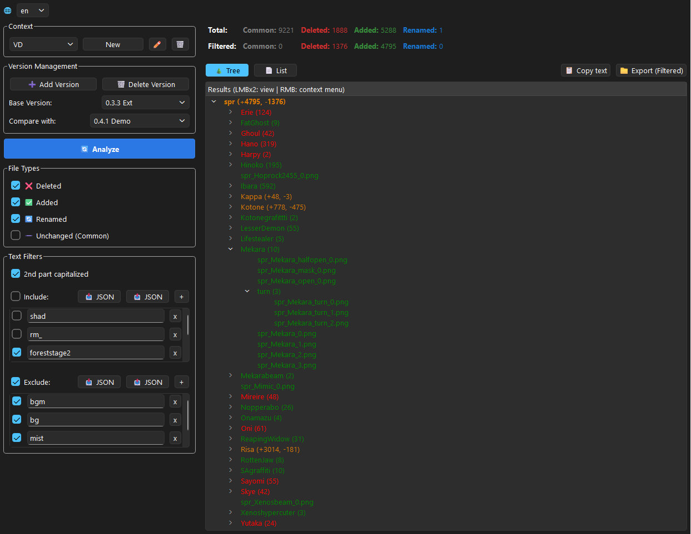

# VIVID INSPECTOR

> 🤖 **Vibe Coding Project:** This project was created entirely using AI-generated code

Vivid Inspector is a desktop tool designed for managing and comparing unpacked game assets. It organizes files into a convenient virtual tree, tracks changes between different versions, and provides powerful filtering and export capabilities.

## How to download and run
1. Go to [Releases](https://github.com/saiaku501d/Vivid-Inspector/releases)
2. Download the latest version
3. Unzip the archive and run it (VividInspector.exe) 

## Key Features
* **Flexible Analysis**: Work with single directories or compare two asset versions (automatically detects Added, Deleted, Common, and Renamed files).
* **Smart Virtual Tree**: Generates an intuitive hierarchical view based on file name prefixes (using `_` as a delimiter).
* **Powerful Filtering**: Toggle file categories on the fly and use customizable Include/Exclude text filters to focus on what matters.
* **Seamless Workflow**: 
    * **Quick Preview**: Double-click files to open them with your default system viewer.
    * **Context Menus**: Right-click to instantly add file names to your filter lists.
    * **Easy Export**: Copy lists to the clipboard or export specific assets to disk while preserving the structure.
* **Version Management**: Organize your work with profiles and manage multiple version paths with support for recursive directory scanning.